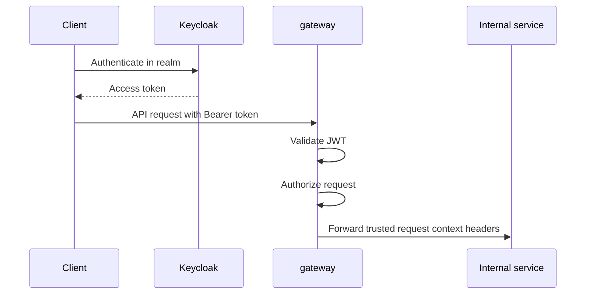

# Authentication And Authorization Architecture

## Overview

This document describes the authentication and authorization architecture of the current project:

- the Keycloak realm model
- the token validation boundary
- the JWT claim model
- the role model
- the trust model between `gateway` and internal services

Operational startup, reset, and token inspection steps belong in [Development](development.md).

## Security Boundary

| Area | Current rule |
| --- | --- |
| Identity provider | Keycloak |
| Browser-facing auth boundary | `gateway` |
| JWT validation | only `gateway` validates Keycloak JWTs directly |
| Downstream identity model | internal services trust forwarded request context headers |
| Tenant resolution | `gateway` resolves `tenant_name` to `tenant_id` for `n2-users` tokens |

## Realm Model

| Realm | Purpose | Main caller | Tenant semantics |
| --- | --- | --- | --- |
| `n2-users` | normal application access | frontend users | exactly one tenant per user context |
| `n2-system` | platform and operational access | system administrators | no tenant resolution required for normal system calls |

## High-Level Authentication Flow

## Keycloak Configuration Model

| Area | Current rule |
| --- | --- |
| Configuration source of truth | realm import JSON files under `infra/keycloak/` |
| `n2-users` realm file | `infra/keycloak/n2-users-realm.json` |
| `n2-system` realm file | `infra/keycloak/n2-system-realm.json` |
| Manual admin UI state | must not be relied on if not represented in realm import files |

## Clients And Scopes

| Realm | Client | Scope | Purpose |
| --- | --- | --- | --- |
| `n2-users` | `n2-users-frontend` | `n2-users-access` | user-facing frontend access |
| `n2-system` | `n2-system-admin` | `n2-system-access` | system and operational access |

## Role Model

### Tenant Realm Roles

| Role | Meaning |
| --- | --- |
| `viewer` | read tenant data |
| `editor` | read tenant data and perform current write operations |
| `tenant-admin` | highest current tenant-scoped application role |

### System Realm Roles

| Role | Meaning |
| --- | --- |
| `platform-admin` | platform administration |
| `support-admin` | support and operational access |
| `security-admin` | security-oriented administrative access |

### Role Modeling Rule

| Rule | Current behavior |
| --- | --- |
| Authorization grouping | modeled as Keycloak realm roles |
| Keycloak groups | not used for application authorization |
| Downstream role transport | roles are forwarded through trusted request context |

## Token Model

### Validation Model

| Validation aspect | Current behavior |
| --- | --- |
| Issuer validation | enabled |
| Signature validation | enabled |
| Lifetime validation | enabled |
| Audience validation | enabled when configured |
| Signing key source | realm-specific JWKS URL |
| Clock skew | one minute |

### Required Claims For `n2-users`

| Claim | Required | Meaning |
| --- | --- | --- |
| `iss` | yes | realm issuer |
| `sub` | yes | stable user identifier |
| `tenant_name` | yes | tenant name used by `gateway` for tenant resolution |
| `roles` | yes | tenant realm roles |
| `authz_version` | yes | authorization snapshot version |
| `iat` | yes | issued-at timestamp |
| `nbf` | yes | not-before timestamp |
| `exp` | yes | expiry timestamp |
| `jti` | yes | token identifier |
| `email` | optional | user email |
| `preferred_username` | optional | login or display name |
| `sid` | optional | login session identifier, not the user identifier |

### Required Claims For `n2-system`

| Claim | Required | Meaning |
| --- | --- | --- |
| `iss` | yes | realm issuer |
| `sub` | yes | stable system user identifier |
| `roles` | yes | system realm roles |
| `iat` | yes | issued-at timestamp |
| `nbf` | yes | not-before timestamp |
| `exp` | yes | expiry timestamp |
| `jti` | yes | token identifier |
| `email` | optional | user email |
| `preferred_username` | optional | login or display name |

### Claim Mapping

| Realm | Keycloak source | Token claim |
| --- | --- | --- |
| `n2-users` | user property `id` | `sub` |
| `n2-users` | user attribute `tenant_name` | `tenant_name` |
| `n2-users` | user attribute `authz_version` | `authz_version` |
| `n2-users` | realm roles | `roles` |
| `n2-system` | user property `id` | `sub` |
| `n2-system` | realm roles | `roles` |

## Authorization Policy Model

| Policy area | Current behavior |
| --- | --- |
| Tenant business endpoints | require `n2-users` token and tenant role |
| System endpoints | require `n2-system` token and system role |
| Authenticated tenant policy | requires resolved `tenant_id` |
| Tenant source of truth | resolved tenant context, not caller-supplied request body fields |

## Trusted Downstream Request Context

The `gateway` forwards trusted request headers after successful validation and authorization.
The detailed header list is documented in [Communication architecture](communication-architecture.md).

### Downstream Trust Model

| Rule | Current behavior |
| --- | --- |
| Downstream JWT validation | not required for normal internal request handling |
| Downstream tenant source | forwarded trusted headers |
| Downstream user source | forwarded trusted headers |
| Gateway role | authentication and request context boundary |

## Tenant Resolution

| Input | Resolver | Output |
| --- | --- | --- |
| JWT `tenant_name` | `gateway` through the `system` service | `tenant_id` |

## Development Users

### Seeded `n2-users` Users

| Username | Role |
| --- | --- |
| `admin@example.com` | `tenant-admin` |
| `editor@example.com` | `editor` |
| `viewer@example.com` | `viewer` |

### Seeded `n2-system` Users

| Username | Role |
| --- | --- |
| `platform-admin@example.com` | `platform-admin` |
| `support-admin@example.com` | `support-admin` |
| `security-admin@example.com` | `security-admin` |

## Out Of Scope

| Area | Current status |
| --- | --- |
| LDAP integration | out of scope |
| external IdP federation | out of scope |
| intermediate token exchange service | out of scope |
| dependency on undeclared Keycloak UI state | out of scope |

## Related Documents

- [Project architecture](project-architecture.md)
- [Communication architecture](communication-architecture.md)
- [Database architecture](database-architecture.md)
- [Logging architecture](logging-architecture.md)
- [Development](development.md)
