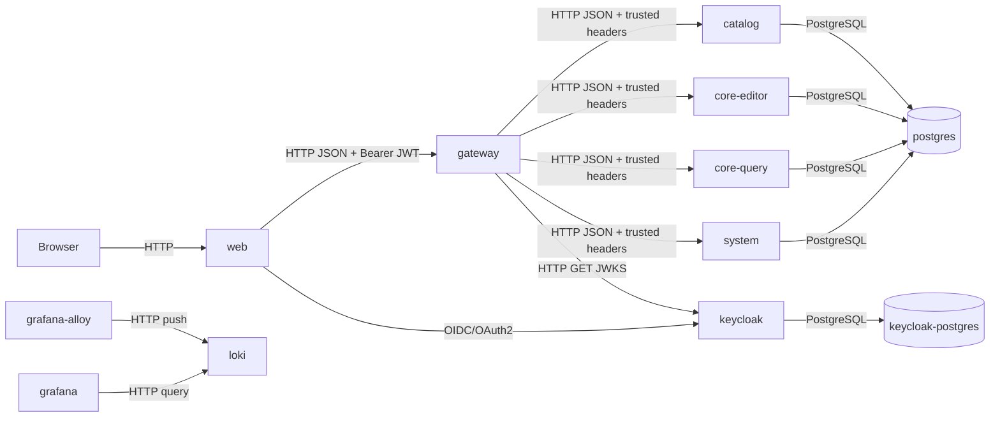
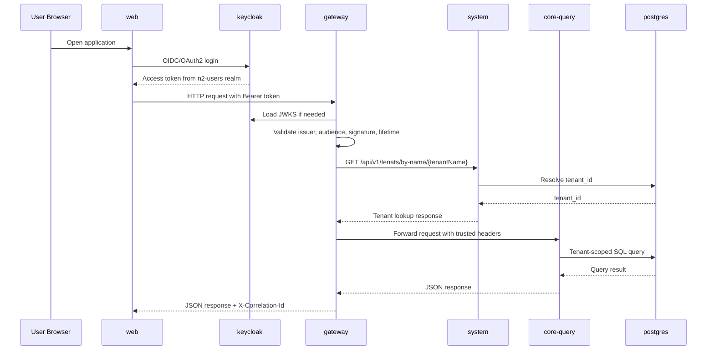

# Communication Architecture

## Overview

This document describes the current communication architecture of the project:

- communication between modules, services, and containers
- protocols used on each connection
- JWT token contents and claim meaning
- trusted request headers forwarded by `gateway`
- the main request flows for tenant and system traffic

The current security boundary is the `gateway` service.
Only `gateway` validates Keycloak JWTs directly.
Downstream services trust the request context headers forwarded by `gateway`.

## Module And Container Map

| Module or container | Role | Listens on | Main inbound communication | Main outbound communication |
| --- | --- | --- | --- | --- |
| `web` | Browser frontend | `:8080` | HTTP from browser | HTTP to `gateway`, OIDC/OAuth2 to Keycloak |
| `gateway` | Public backend entrypoint and auth boundary | `:5100` | HTTP from `web` or API clients with Bearer JWT | HTTP to `catalog`, `core-editor`, `core-query`, `system`; HTTP to Keycloak JWKS |
| `catalog` | Tenant-scoped catalog reads | `:5201` | HTTP from `gateway` with trusted headers | PostgreSQL to `postgres` |
| `core-editor` | Tenant-scoped write operations | `:5202` | HTTP from `gateway` with trusted headers | PostgreSQL to `postgres` |
| `core-query` | Tenant-scoped object reads | `:5203` | HTTP from `gateway` with trusted headers | PostgreSQL to `postgres` |
| `system` | System and tenant lookup operations | `:5204` | HTTP from `gateway` with trusted headers | PostgreSQL to `postgres` |
| `postgres` | Application database | `:5432` | PostgreSQL from business services | none |
| `keycloak` | Authentication and authorization server | `:8081` externally, `:8080` in Docker network | OIDC/OAuth2 from `web`; JWKS fetch from `gateway` | PostgreSQL to `keycloak-postgres` |
| `keycloak-postgres` | Dedicated Keycloak database | internal | PostgreSQL from `keycloak` | none |
| `loki` | Log storage | `:3100` | HTTP from `grafana-alloy` | none |
| `grafana-alloy` | Docker log collector and forwarder | internal | Docker log stream | HTTP to `loki` |
| `grafana` | Observability UI | `:3000` | HTTP from browser | HTTP to `loki` |

## Runtime Topology

## Communication Matrix

| Source | Target | Purpose | Protocol | Auth model | Payload form |
| --- | --- | --- | --- | --- | --- |
| Browser | `web` | Frontend delivery | HTTP | none | HTML, CSS, JS assets |
| `web` | `keycloak` | Login, token acquisition, refresh | OIDC/OAuth2 over HTTP in development | Keycloak realm login | form posts, redirects, tokens |
| `web` | `gateway` | User and admin API calls | HTTP/1.1 JSON | `Authorization: Bearer <JWT>` | JSON |
| `gateway` | `keycloak` | Signing key fetch for JWT validation | HTTP GET to JWKS endpoint | none beyond Keycloak endpoint availability | JWKS JSON |
| `gateway` | `catalog` | Catalog reads | HTTP/1.1 JSON | trusted forwarded headers | JSON |
| `gateway` | `core-query` | Object reads | HTTP/1.1 JSON | trusted forwarded headers | JSON |
| `gateway` | `core-editor` | Object writes | HTTP/1.1 JSON | trusted forwarded headers | JSON |
| `gateway` | `system` | System APIs and tenant lookup by name | HTTP/1.1 JSON | trusted forwarded headers | JSON |
| `catalog` | `postgres` | Read catalog data | PostgreSQL wire protocol | database credentials | SQL |
| `core-query` | `postgres` | Read object data | PostgreSQL wire protocol | database credentials | SQL |
| `core-editor` | `postgres` | Write object data | PostgreSQL wire protocol | database credentials | SQL |
| `system` | `postgres` | Tenant and system data | PostgreSQL wire protocol | database credentials | SQL |
| `keycloak` | `keycloak-postgres` | Identity data persistence | PostgreSQL wire protocol | database credentials | SQL |

## Security Boundary

| Area | Current rule |
| --- | --- |
| Public backend boundary | `gateway` |
| JWT validation | only `gateway` validates JWTs |
| Tenant resolution | `gateway` resolves `tenant_name` to `tenant_id` |
| Downstream identity source | forwarded trusted request headers |
| Downstream JWT validation | not used in normal request handling |
| Browser-facing service | `gateway` only |

## Main Request Flows

### Tenant User Flow

### System User Flow

| Step | Description |
| --- | --- |
| 1 | The client authenticates against the `n2-system` realm in Keycloak. |
| 2 | The client calls `gateway` with the access token. |
| 3 | `gateway` validates the JWT with the configured issuer, audience, lifetime, and JWKS signing keys. |
| 4 | No tenant resolution is performed for `n2-system` tokens. |
| 5 | `gateway` forwards the request to `system` with trusted headers such as user ID, realm, roles, and optional email or username. |
| 6 | `system` executes the requested tenant administration or self-inspection operation. |

## External And Internal HTTP Endpoints

### Public Entry Points

| Service | Base URL | Intended caller | Notes |
| --- | --- | --- | --- |
| `web` | `http://localhost:8080` | browser | static frontend |
| `gateway` | `http://localhost:5100` | frontend and API clients | only public backend entrypoint |
| `keycloak` | `http://localhost:8081` | browser and developers | realms and admin UI |
| `grafana` | `http://localhost:3000` | developers | observability UI |

### Internal Service Endpoints Used By `gateway`

| Target service | Internal base URL | Endpoint(s) used by `gateway` | Method | Purpose |
| --- | --- | --- | --- | --- |
| `catalog` | `http://catalog:5201` | `/internal/status` | `GET` | health-style internal status |
| `catalog` | `http://catalog:5201` | `/api/catalog/categories` | `GET` | category list |
| `catalog` | `http://catalog:5201` | `/api/catalog/types` | `GET` | type list |
| `core-query` | `http://core-query:5203` | `/internal/status` | `GET` | health-style internal status |
| `core-query` | `http://core-query:5203` | `/api/query/objects` | `GET` | object list query |
| `core-editor` | `http://core-editor:5202` | `/internal/status` | `GET` | health-style internal status |
| `core-editor` | `http://core-editor:5202` | `/api/editor/object` | `POST` | object creation |
| `system` | `http://system:5204` | `/internal/status` | `GET` | health-style internal status |
| `system` | `http://system:5204` | `/api/v1/tenats/by-name/{tenantName}` | `GET` | `tenant_name` to `tenant_id` resolution |
| `system` | `http://system:5204` | `/api/v1/me` | `GET` | current user context |
| `system` | `http://system:5204` | `/api/v1/tenants` | `GET`, `POST` | tenant list and create |
| `system` | `http://system:5204` | `/api/v1/tenants/{tenantId}` | `GET`, `PUT`, `PATCH`, `DELETE` | tenant management |

## Protocol Details

| Connection | Protocol details | Notes |
| --- | --- | --- |
| Browser -> `web` | HTTP | local development static site |
| Browser or `web` -> `gateway` | HTTP/1.1 with JSON REST | bearer token for protected APIs |
| `web` -> `keycloak` | OpenID Connect / OAuth2 | Keycloak realms `n2-users` and `n2-system` |
| `gateway` -> internal services | HTTP/1.1 with JSON REST | identity forwarded through headers |
| `gateway` -> Keycloak JWKS | HTTP GET | signing key download and refresh |
| Services -> PostgreSQL | PostgreSQL native wire protocol | service-specific DB access |

## JWT Token Model

### Realm Separation

| Realm | Primary use | Typical caller | Tenant context |
| --- | --- | --- | --- |
| `n2-users` | tenant-scoped application access | normal frontend users | `tenant_name` in token, `tenant_id` resolved by `gateway` |
| `n2-system` | platform and operational access | system administrators | no tenant resolution required |

### Required Claims For `n2-users` Access Tokens

| Claim | Required | Example source | Meaning in this project |
| --- | --- | --- | --- |
| `iss` | yes | Keycloak issuer URL | identifies realm issuer |
| `sub` | yes | Keycloak user ID | stable user identifier |
| `tenant_name` | yes | Keycloak user attribute | tenant name resolved by `gateway` to platform `tenant_id` |
| `roles` | yes | Keycloak realm roles mapper | application roles such as `viewer`, `editor`, `tenant-admin` |
| `authz_version` | yes | Keycloak user attribute | authorization snapshot/version value |
| `iat` | yes | Keycloak standard claim | issued-at timestamp |
| `nbf` | yes | Keycloak standard claim | not-before timestamp |
| `exp` | yes | Keycloak standard claim | expiry timestamp |
| `jti` | yes | Keycloak standard claim | token identifier |
| `email` | optional | Keycloak standard claim | email for forwarded user context |
| `preferred_username` | optional | Keycloak standard claim | display/login name for forwarded user context |
| `sid` | optional | Keycloak standard claim | login session identifier, not the user ID |

### Required Claims For `n2-system` Access Tokens

| Claim | Required | Meaning in this project |
| --- | --- | --- |
| `iss` | yes | identifies the `n2-system` realm issuer |
| `sub` | yes | stable system user identifier |
| `roles` | yes | system roles such as `platform-admin`, `support-admin`, `security-admin` |
| `iat` | yes | issued-at timestamp |
| `nbf` | yes | not-before timestamp |
| `exp` | yes | expiry timestamp |
| `jti` | yes | token identifier |
| `email` | optional | forwarded as request context when present |
| `preferred_username` | optional | forwarded as request context when present |

### Keycloak Claim Mapping

| Realm | Source in Keycloak | Token claim |
| --- | --- | --- |
| `n2-users` | user property `id` | `sub` |
| `n2-users` | user attribute `tenant_name` | `tenant_name` |
| `n2-users` | user attribute `authz_version` | `authz_version` |
| `n2-users` | realm roles | `roles` |
| `n2-system` | user property `id` | `sub` |
| `n2-system` | realm roles | `roles` |

## Request Headers

### Client To `gateway`

| Header | Required | Example | Meaning |
| --- | --- | --- | --- |
| `Authorization` | yes for protected endpoints | `Bearer eyJ...` | Keycloak access token sent by the client |
| `X-Correlation-Id` | optional | UUID v7 | caller-supplied request correlation ID; `gateway` creates one if missing |

### Trusted Headers Forwarded By `gateway`

These headers are produced by the `UserContextForwardingHandler` and must be treated as trusted only when they come from `gateway`.

| Header | Source | Required downstream | Meaning |
| --- | --- | --- | --- |
| `X-User-Id` | JWT `sub` | yes | stable current user ID |
| `X-Tenant-Id` | resolved by `gateway` from `tenant_name` | required for tenant-scoped services | authoritative tenant ID for business requests |
| `X-Username` | JWT `preferred_username` or identity name | optional | user login/display name |
| `X-Email` | JWT `email` | optional | user email |
| `X-Realm` | derived from JWT issuer | yes | `n2-users` or `n2-system` |
| `X-Roles` | JWT `roles` | yes | comma-separated role list |
| `X-Authz-Version` | JWT `authz_version` | optional | authorization version propagated downstream |
| `X-Correlation-Id` | current request correlation context | yes | end-to-end request tracing identifier |

### Header Semantics In Downstream Services

| Header | How downstream services use it |
| --- | --- |
| `X-User-Id` | builds the current user context |
| `X-Tenant-Id` | drives tenant-scoped database filtering |
| `X-Realm` | distinguishes user traffic from system traffic |
| `X-Roles` | drives role-based authorization decisions in service logic |
| `X-Authz-Version` | exposes the caller authorization version to downstream logic |
| `X-Correlation-Id` | ties logs and upstream requests together |

## Tenant Resolution

| Input | Resolver | Output | Used for |
| --- | --- | --- | --- |
| JWT `tenant_name` | `gateway` through `system` service | `tenant_id` | authoritative tenant context for downstream services |

Important current rule:

- tenant business endpoints do not use tenant identity from request body or URL as the source of truth
- the authoritative tenant context is the resolved `tenant_id` forwarded by `gateway`

## Current Design Constraints

| Constraint | Current behavior |
| --- | --- |
| Public traffic path | all user-facing backend traffic terminates at `gateway` |
| Internal trust model | internal services trust forwarded headers instead of direct JWT validation |
| Backward compatibility | not required during current development stage |
| Tenant model | one user belongs to exactly one tenant |
| Delete behavior | runtime business deletes are soft deletes, development DB resets are destructive |

## Related Documents

- [Project architecture](project-architecture.md)
- [Authentication and authorization architecture](authentication-and-authorization-architecture.md)
- [Development](development.md)
- [Logging architecture](logging-architecture.md)
- [Database architecture](database-architecture.md)
