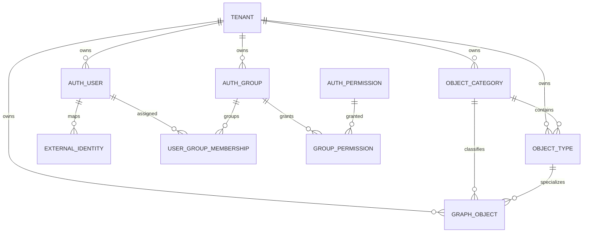
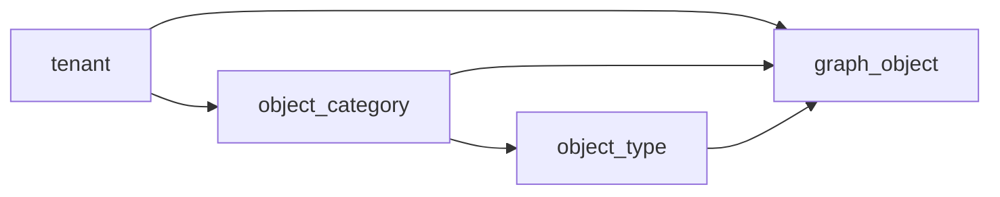
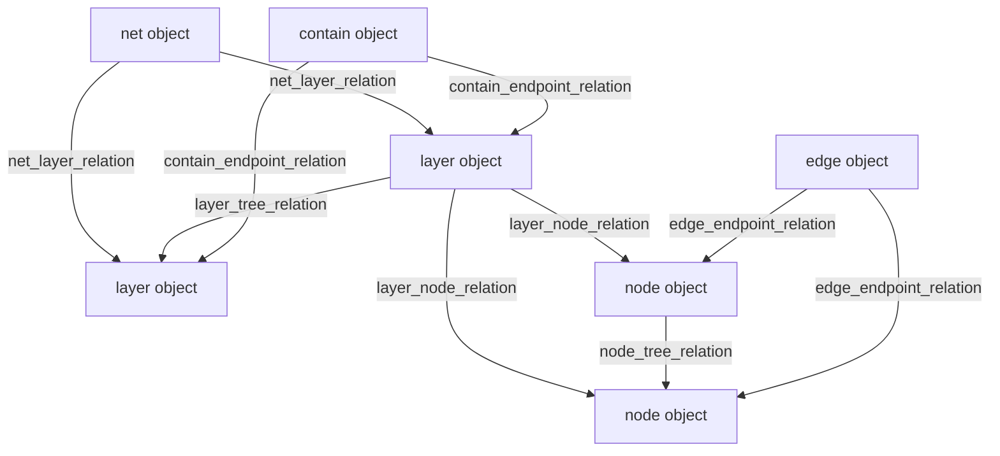
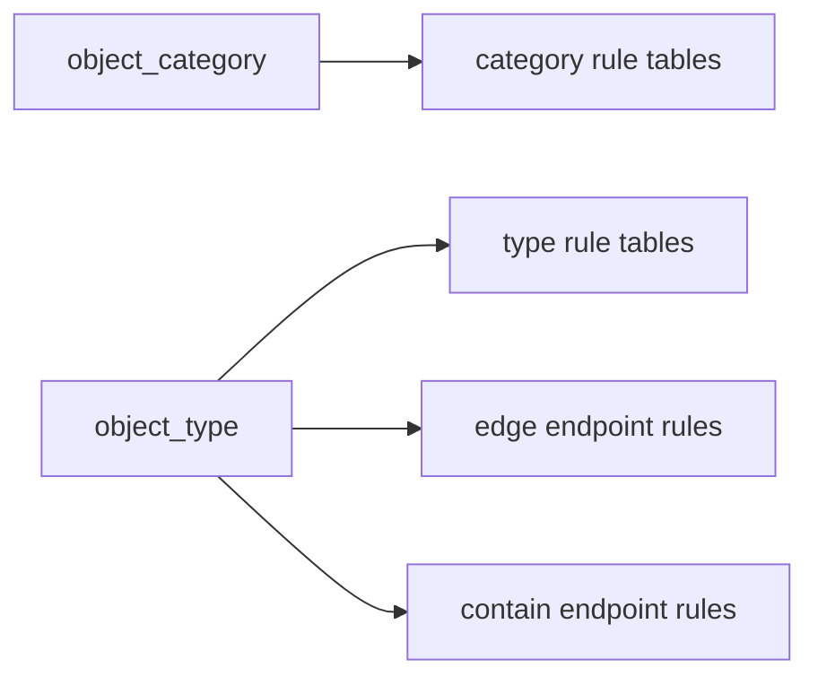
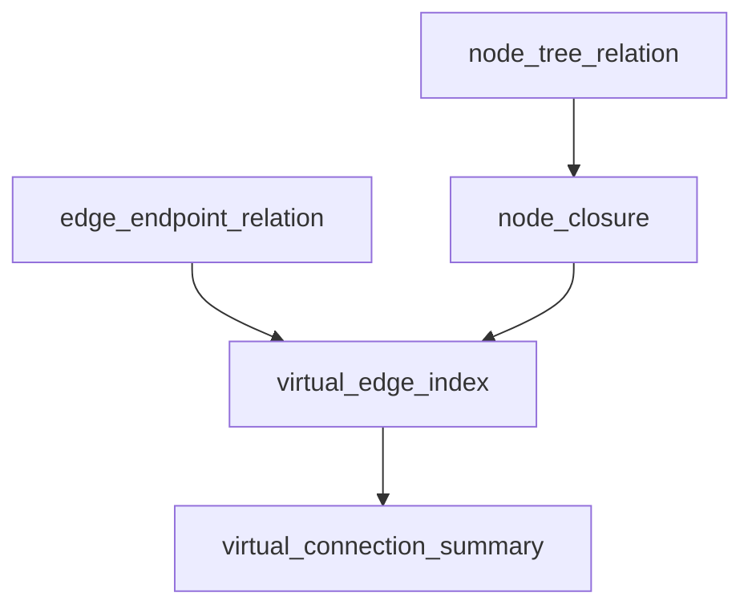
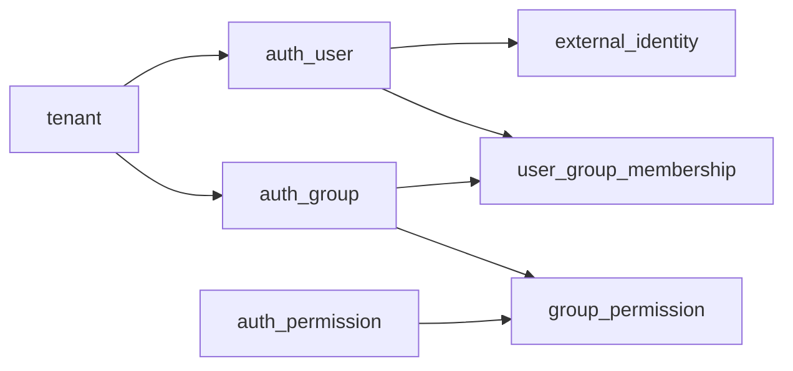

# Database Architecture

## Overview

This document describes the current application database as a data model:

- schemas and source files
- core entities and relationships
- rule tables and derived tables
- tenant isolation rules
- soft-delete behavior
- database functions and trigger responsibilities

Operational workflows such as reset, rebuild, and local Docker usage belong in [Development](development.md).

## Source Of Truth

| Area | Current rule |
| --- | --- |
| Database engine | PostgreSQL 16 |
| Source of truth | SQL files under `db/schema/` |
| Development migration model | no migration chain, destructive rebuild of current schema |
| Backward compatibility | not required during current development stage |
| Main schema namespace | `app` |

## Schema Files

| File | Purpose |
| --- | --- |
| `db/schema/000_drop_and_create_schema.sql` | recreates the `app` schema |
| `db/schema/001_extensions_types.sql` | extensions and shared enum types |
| `db/schema/010_tenant.sql` | tenant master table |
| `db/schema/020_category_type_object.sql` | categories, types, and graph objects |
| `db/schema/030_relations.sql` | graph relationship tables |
| `db/schema/040_rules.sql` | tenant-specific rule tables |
| `db/schema/050_closure_virtual.sql` | closure and virtual summary tables |
| `db/schema/060_permissions_audit.sql` | users, groups, permissions, and identity mapping |
| `db/schema/070_functions_triggers.sql` | validation functions and trigger logic |
| `db/schema/900_seed_minimal_test_data.sql` | minimal local seed data |

## Database Structure

### Main Schema Areas

| Area | Main tables | Purpose |
| --- | --- | --- |
| Tenant core | `tenant` | tenant root record |
| Type system | `object_category`, `object_type` | defines graph semantics and allowed object kinds |
| Object storage | `graph_object` | stores all business objects in one flat table |
| Graph relations | `net_layer_relation`, `layer_tree_relation`, `layer_node_relation`, `node_tree_relation`, `edge_endpoint_relation`, `contain_endpoint_relation` | stores graph topology |
| Rules | `rule_*` tables | constrains which category/type combinations are allowed |
| Derived structures | `node_closure`, `virtual_edge_index`, `virtual_connection_summary` | accelerates traversal and virtual connectivity queries |
| Authorization model | `auth_user`, `external_identity`, `auth_group`, `auth_permission`, `user_group_membership`, `group_permission` | application-owned auth and permission model |

### High-Level Entity Diagram

## Shared Types And Conventions

### Enum Types

| Type | Values | Meaning |
| --- | --- | --- |
| `app.record_status` | `active`, `inactive`, `deleted` | shared lifecycle status used by business and relation rows |
| `app.object_kind` | `net`, `layer`, `node`, `edge`, `contain` | high-level object family |

### Cross-Cutting Modeling Rules

| Rule | Current behavior |
| --- | --- |
| Tenant isolation | tenant-owned tables carry `tenant_id` and often use composite foreign keys |
| Primary references | IDs only; names are display-only |
| Object kind storage | `object_kind` exists on `object_category`, not on `graph_object` |
| Type-category consistency | `graph_object.type_id` must belong to the same category as `graph_object.category_id` |
| Delete semantics | runtime delete is soft-delete through status and timestamps |
| Development rebuild | destructive regeneration is allowed, but it is a development workflow concern |

## Core Tables

### Tenant Table

| Table | Purpose | Primary key | Important columns |
| --- | --- | --- | --- |
| `app.tenant` | root tenant record | `tenant_id` | `tenant_name`, `tenant_status`, `properties`, timestamps, `deleted_at` |

### Type System Tables

| Table | Purpose | Primary key | Key foreign keys | Notes |
| --- | --- | --- | --- | --- |
| `app.object_category` | tenant-owned category definition | `category_id` | `tenant_id -> tenant` | stores `object_kind` and category-level JSON schema |
| `app.object_type` | concrete type under a category | `type_id` | `(tenant_id, category_id) -> object_category` | type inherits kind through category |
| `app.graph_object` | flat storage for all business objects | `object_id` | `tenant_id -> tenant`, `(tenant_id, category_id) -> object_category`, `(tenant_id, category_id, type_id) -> object_type` | `object_kind` is intentionally absent |

### Type System Diagram

### `graph_object` Column Semantics

| Column | Meaning |
| --- | --- |
| `object_id` | stable object identifier |
| `tenant_id` | tenant ownership boundary |
| `object_name` | display name only |
| `category_id` | object category reference |
| `type_id` | concrete type reference within the same category |
| `properties` | JSONB payload for object-specific data |
| `object_status` | soft-delete and lifecycle state |
| `delete_operation_id` | delete operation grouping hook |

## Relation Tables

### Relation Families

| Table | Relation meaning | Scope | Important constraints |
| --- | --- | --- | --- |
| `app.net_layer_relation` | a layer belongs to a net | tenant, per net/layer | active layer can belong to one net |
| `app.layer_tree_relation` | parent-child hierarchy between layers | tenant, within a net | parent and child must differ |
| `app.layer_node_relation` | a node belongs to a layer | tenant, per layer/node | active node can belong to one layer |
| `app.node_tree_relation` | parent-child hierarchy between nodes | tenant, within a layer | parent and child must differ, cycles blocked |
| `app.edge_endpoint_relation` | edge connects source and target node | tenant, within a layer | edge must be kind `edge`, endpoints must be kind `node` |
| `app.contain_endpoint_relation` | contain relation links source object to target object across layers | tenant, cross-layer | source and target layer must differ |

### Graph Topology Diagram

### Relation Modeling Pattern

| Pattern | Current implementation |
| --- | --- |
| Status tracking | relation tables use `relation_status` with soft-delete metadata |
| Kind enforcement | relation rows carry explicit kind columns plus `CHECK` constraints |
| Tenant safety | composite foreign keys prevent cross-tenant linking |
| Active uniqueness | partial unique indexes enforce one active parent or membership where required |
| Validation entrypoint | insert triggers call validation functions before accepting active rows |

## Rule Tables

Rule tables describe which category and type combinations are allowed inside the graph model.
They are tenant-specific and ID-only.

### Rule Table Groups

| Group | Tables | Purpose |
| --- | --- | --- |
| Net composition rules | `rule_net_category_layer_category`, `rule_net_type_layer_type`, `rule_net_category_contain_category`, `rule_net_type_contain_type` | defines what layers and contains may exist inside a net |
| Layer composition rules | `rule_layer_category_child_layer_category`, `rule_layer_type_child_layer_type`, `rule_layer_category_node_category`, `rule_layer_type_node_type`, `rule_layer_category_edge_category`, `rule_layer_type_edge_type` | defines what child layers, nodes, and edges may exist inside a layer |
| Node hierarchy rules | `rule_node_category_child_node_category`, `rule_node_type_child_node_type` | defines allowed node tree parent-child pairs |
| Endpoint rules | `rule_edge_endpoint_type`, `rule_contain_endpoint_type` | defines legal endpoint type combinations |

### Rule Model Diagram

### Rule Table Shape

| Characteristic | Current behavior |
| --- | --- |
| Tenant-scoped | every rule row includes `tenant_id` |
| ID-only | rules reference categories and types by ID, not by names |
| Statused | every rule table has `rule_status` |
| Lookup-friendly | active lookup indexes exist on the parent-side columns |
| Enforcement state | schema stores rules; full runtime validation is still partial |

## Derived Tables

### Derived Structure Purpose

| Table | Purpose | Key columns |
| --- | --- | --- |
| `app.node_closure` | closure table for fast ancestor and subtree queries | `layer_id`, `ancestor_node_id`, `descendant_node_id`, `depth` |
| `app.virtual_edge_index` | maps real edges to ancestor-level virtual edge projections | `edge_id`, ancestor node pairs, depth-from-ancestor columns |
| `app.virtual_connection_summary` | summarized virtual connectivity between ancestor nodes | ancestor node pair, `edge_count`, `direct_edge_count` |

### Derived Structure Diagram

### Derived Table Notes

| Table | Important rule |
| --- | --- |
| `node_closure` | every node should have a reflexive row with depth `0` |
| `virtual_edge_index` | stores ancestor-expanded view of concrete edges |
| `virtual_connection_summary` | summarizes whether ancestor nodes are virtually connected through descendants |

## Authorization And Identity Tables

### Authorization Tables

| Table | Purpose | Key relationships |
| --- | --- | --- |
| `app.auth_user` | internal tenant-scoped user record owned by the application | belongs to `tenant` |
| `app.external_identity` | maps external IdP identity to internal user | points to `auth_user` |
| `app.auth_group` | tenant-scoped authorization group | belongs to `tenant` |
| `app.auth_permission` | stable application permission catalog | standalone permission definitions |
| `app.user_group_membership` | assigns users to groups | links `auth_user` and `auth_group` inside one tenant |
| `app.group_permission` | assigns permissions to groups | links `auth_group` and `auth_permission` |

### Authorization Diagram

### Authorization Modeling Notes

| Rule | Current behavior |
| --- | --- |
| Internal user model | `auth_user` is application-owned, not Keycloak-owned |
| External identity mapping | `external_identity` stores provider, issuer, and external subject |
| Permission identity | `auth_permission.code` is the stable permission identifier |
| Tenant safety | composite FKs on memberships prevent cross-tenant assignment |
| Auth versioning | `auth_user.authz_version` supports authorization snapshot versioning |

## Functions And Triggers

### Main Functions

| Function | Purpose |
| --- | --- |
| `app.touch_updated_at()` | updates `updated_at` in triggers |
| `app.assert_active_graph_object(...)` | ensures an object exists and is active |
| `app.assert_object_kind(...)` | ensures an object resolves to the expected kind through its category |

### Validation And Maintenance Triggers

| Trigger function | Responsibility |
| --- | --- |
| `app.after_layer_node_relation_insert()` | seeds reflexive `node_closure` rows for new active layer-node membership |
| `app.before_net_layer_relation_insert_validate()` | validates active net-layer inserts |
| `app.before_layer_tree_relation_insert_validate()` | validates active layer-tree inserts |
| `app.before_layer_node_relation_insert_validate()` | validates active layer-node inserts |
| `app.before_node_tree_relation_insert_validate()` | validates active node-tree inserts and blocks cycles |
| `app.after_node_tree_relation_insert_update_closure()` | updates closure rows after node-tree insert |

### Trigger Design Intent

| Concern | Current database approach |
| --- | --- |
| Object kind validation | resolved dynamically from `object_category` |
| Active object validation | performed in PL/pgSQL before relation inserts |
| Closure maintenance | maintained incrementally on node hierarchy changes |
| Rule enforcement | partly modeled in schema, not fully enforced yet |

## Tenant Isolation

### Isolation Pattern

| Mechanism | Description |
| --- | --- |
| `tenant_id` on tenant-owned tables | most business tables are tenant-scoped |
| Composite foreign keys | child rows must reference parent rows within the same tenant |
| Partial unique indexes | active uniqueness is enforced within tenant scope |
| Service-layer filtering | application services query by forwarded tenant context |

### Isolation Example

`graph_object` cannot point to a category or type from another tenant because its foreign keys include `tenant_id`.

## Soft Delete Model

### Shared Delete Pattern

| Pattern element | Typical columns |
| --- | --- |
| lifecycle status | `*_status` columns using `app.record_status` |
| delete timestamp | `deleted_at` |
| deleted by | `deleted_by` where present |
| delete grouping | `delete_operation_id` on some graph and relation tables |

### Delete Semantics

| Context | Behavior |
| --- | --- |
| Runtime business delete | soft delete using status `deleted` |
| Development schema evolution | destructive rebuild from SQL files |

## Important Constraints And Indexes

| Area | Constraint or index pattern | Purpose |
| --- | --- | --- |
| Categories and types | composite uniques on `(tenant_id, category_id)` and `(tenant_id, category_id, type_id)` | tenant-safe references |
| Objects | GIN index on `graph_object.properties` | JSONB search support |
| Relations | partial unique indexes on active memberships | prevents conflicting active parent/member rows |
| Rules | active lookup indexes | fast rule resolution |
| Derived tables | ancestor/descendant lookup indexes | fast traversal and summary queries |
| Authorization | unique active indexes on email, permission code, memberships, and grants | integrity of auth model |

## Current Limitations

| Area | Current limitation |
| --- | --- |
| JSON validation | JSON Schema validation is not fully enforced |
| Rule enforcement | full category/type rule validation is still partial |
| Closure rebuild | full rebuild procedures are not implemented |
| Virtual summaries | full decrement/rebuild support is not complete |
| Subtree moves | dedicated full subtree move procedure is not implemented |
| Layer closure | not implemented |
| RLS | row-level security is not enabled |

## Related Documents

- [Development](development.md)
- [Project architecture](project-architecture.md)
- [Communication architecture](communication-architecture.md)
- [Authentication and authorization architecture](authentication-and-authorization-architecture.md)
- [Logging architecture](logging-architecture.md)
