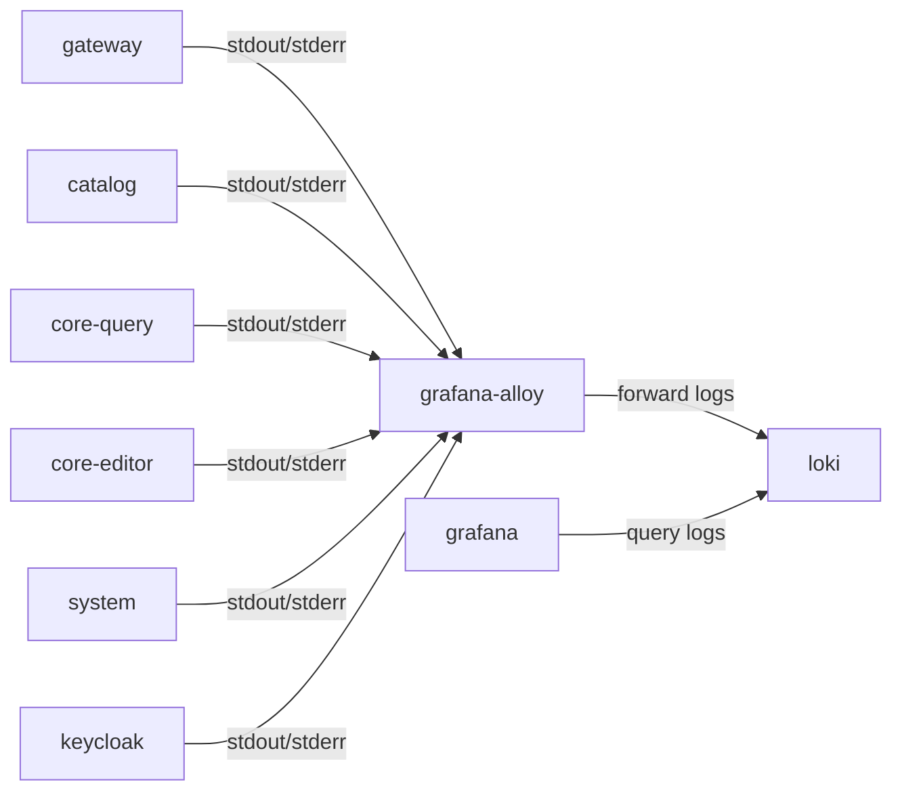

# Logging Architecture

## Overview

This document describes the current logging and observability architecture:

- how logs are emitted by services
- how logs move between containers
- which components collect, store, and query logs
- which labels and fields are used
- where the architectural trust and responsibility boundaries are

Operational startup and reset steps belong in [Development](development.md).

## Logging Goals

| Goal | Current implementation |
| --- | --- |
| Central collection | logs are collected from container stdout/stderr |
| Structured output | .NET services emit structured single-line JSON |
| Transport separation | applications do not push directly to Loki |
| Queryability | Grafana queries Loki for search and inspection |
| Low-cardinality indexing | Loki labels stay limited to stable dimensions |

## Runtime Components

| Component | Role | Responsibility |
| --- | --- | --- |
| .NET services | log producers | emit structured JSON to stdout/stderr |
| `keycloak` | log producer | emits container logs to stdout/stderr |
| `grafana-alloy` | collector and forwarder | discovers Docker containers and forwards matching logs |
| `loki` | log store | stores and indexes collected logs |
| `grafana` | query UI | presents logs and dashboards |

## Logging Flow

## Communication And Protocol View

| Source | Target | Purpose | Protocol or transport |
| --- | --- | --- | --- |
| .NET service container | Docker runtime | emit application logs | stdout/stderr stream |
| Keycloak container | Docker runtime | emit service logs | stdout/stderr stream |
| `grafana-alloy` | Docker daemon | container discovery and log read | Docker socket access |
| `grafana-alloy` | `loki` | push collected logs | HTTP |
| `grafana` | `loki` | query and search logs | HTTP |

## Application Logging Model

### .NET Services

| Rule | Current behavior |
| --- | --- |
| Logger API | use `ILogger<T>` |
| Provider | Serilog is the configured logging provider |
| Output destination | stdout/stderr only |
| Format | structured single-line JSON |
| Direct file logging | not used |
| Direct database logging | not used |
| Direct Loki sink | not used |

### Example Responsibility Split

| Layer | Logging responsibility |
| --- | --- |
| application code | create structured log events |
| logging provider | serialize events as JSON |
| container runtime | expose stdout/stderr stream |
| Alloy | collect and forward |
| Loki | store and index |
| Grafana | query and display |

## Label Strategy

### Allowed Loki Labels

| Label | Purpose |
| --- | --- |
| `service` | service identity |
| `environment` | deployment environment |
| `host` | host identity |
| `runtime` | runtime type |
| `container` | container identity |

### High-Cardinality Fields

These values stay in the JSON payload and must not be promoted to Loki labels.

| Field | Reason |
| --- | --- |
| `correlationId` | request-specific |
| `requestId` | request-specific |
| `userId` | user-specific |
| `tenantId` | tenant-specific |
| `objectId` | object-specific |
| `categoryId` | entity-specific |
| `traceId` | trace-specific |
| `runId` | execution-specific |

## Correlation Model

| Element | Current behavior |
| --- | --- |
| Correlation header | `X-Correlation-Id` |
| Generation | created by the HTTP layer when missing |
| Propagation | forwarded on upstream HTTP calls |
| Log context | pushed into structured logs for cross-service tracing |

## Architectural Rules

| Rule | Current behavior |
| --- | --- |
| Application log storage | not stored in PostgreSQL |
| Audit log tables | not implemented by default |
| Event history | not introduced implicitly as part of logging |
| Service sinks | services do not write directly to Loki |
| Collection boundary | Alloy owns collection and forwarding |

## Query Model

| Query dimension | Source |
| --- | --- |
| service-level filtering | Loki labels |
| environment-level filtering | Loki labels |
| container-level filtering | Loki labels |
| correlation tracing | JSON fields inside log payloads |
| user or tenant investigation | JSON fields inside log payloads |

## Current Design Constraints

| Constraint | Current behavior |
| --- | --- |
| Container-first collection | logs are expected to be available on stdout/stderr |
| Low-cardinality indexing | only stable labels are indexed in Loki labels |
| Architecture ownership | collection and forwarding are infrastructure concerns, not business service concerns |
| Development scope | architecture is local Docker based |

## Related Documents

- [Project architecture](project-architecture.md)
- [Communication architecture](communication-architecture.md)
- [Authentication and authorization architecture](authentication-and-authorization-architecture.md)
- [Database architecture](database-architecture.md)
- [Development](development.md)
