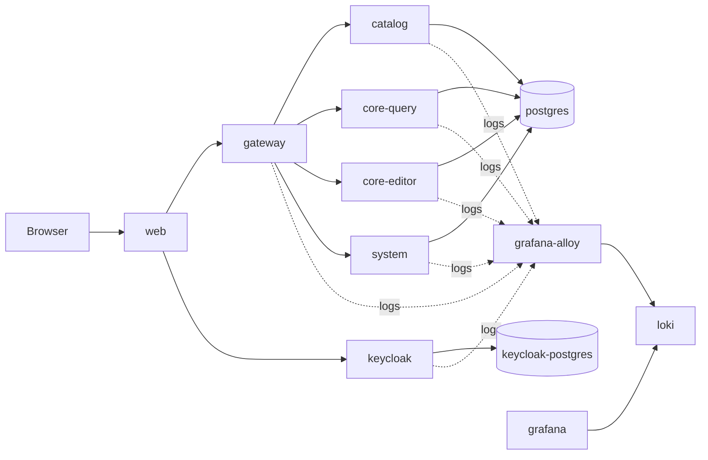

# Project Architecture

## Overview

This document describes the project architecture at a high level:

- the main modules and runtime containers
- the platform boundaries and responsibilities
- the core request paths
- the architectural split between communication, database, logging, and authentication concerns

Deeper architecture details are documented separately:

- [Communication architecture](communication-architecture.md)
- [Database architecture](database-architecture.md)
- [Logging architecture](logging-architecture.md)
- [Authentication and authorization architecture](authentication-and-authorization-architecture.md)

## System Purpose

The project is a compact multi-service platform built around:

- a TypeScript frontend
- a .NET gateway
- several internal .NET business services
- a PostgreSQL database
- a development Keycloak instance for authentication and authorization
- a Grafana, Loki, and Alloy logging stack

## Architectural Principles

| Principle | Current implementation |
| --- | --- |
| Public backend boundary | all browser-facing backend traffic terminates at `gateway` |
| Internal service model | business capabilities are split into compact .NET services |
| Authentication boundary | only `gateway` validates Keycloak JWTs directly |
| Tenant isolation | business services operate on trusted tenant context forwarded by `gateway` |
| Database evolution | current schema is regenerated from SQL source files instead of migration history |
| Logging model | services log to stdout/stderr and observability is handled by the container logging stack |
| Project structure | keep modules compact and service internals flat |

## Main Runtime Building Blocks

| Module | Role | Architectural responsibility |
| --- | --- | --- |
| `web` | frontend | user interface and browser-side application flow |
| `gateway` | public backend entrypoint | JWT validation, authorization boundary, request routing, request context forwarding |
| `catalog` | internal read service | catalog data reads |
| `core-query` | internal read service | business object query operations |
| `core-editor` | internal write service | business object write operations |
| `system` | internal system service | tenant lookup and system-level operations |
| `postgres` | business database | persistent platform data |
| `keycloak` | identity provider | authentication and role-bearing token issuance |
| `grafana-alloy` | log collector | container log discovery and forwarding |
| `loki` | log store | centralized log storage |
| `grafana` | observability UI | log querying and visualization |

## High-Level Topology

## Architectural Layers

| Layer | Components | Responsibility |
| --- | --- | --- |
| Presentation | `web` | renders UI and starts authenticated flows |
| Edge/API boundary | `gateway` | validates tokens, applies public API policy, forwards trusted context |
| Business services | `catalog`, `core-query`, `core-editor`, `system` | execute domain-specific reads and writes |
| Data layer | `postgres` | stores current platform state |
| Identity layer | `keycloak` | manages realms, users, roles, and JWT issuance |
| Observability layer | `grafana-alloy`, `loki`, `grafana` | collects, stores, and exposes logs |

## Core Request Paths

### Tenant User Path

| Step | Description |
| --- | --- |
| 1 | The browser application authenticates through Keycloak in the `n2-users` realm. |
| 2 | The client calls `gateway` with a Bearer access token. |
| 3 | `gateway` validates the JWT and resolves `tenant_name` to `tenant_id`. |
| 4 | `gateway` forwards trusted request headers to downstream business services. |
| 5 | Internal services query or update PostgreSQL using the forwarded tenant context. |

### System User Path

| Step | Description |
| --- | --- |
| 1 | The client authenticates through Keycloak in the `n2-system` realm. |
| 2 | The client calls `gateway` with a Bearer access token. |
| 3 | `gateway` validates the JWT and forwards trusted user context without tenant resolution. |
| 4 | `gateway` routes the request to `system` for platform or operational tasks. |

## Service Responsibilities

| Service | Owns | Does not own |
| --- | --- | --- |
| `gateway` | authentication boundary, request context forwarding, upstream aggregation | direct business persistence |
| `catalog` | catalog reads | token validation |
| `core-query` | business object reads | token validation |
| `core-editor` | business object writes | token validation |
| `system` | tenant lookup and system-scope operations | browser-facing edge authentication |
| `postgres` | durable business state | auth token issuance |
| `keycloak` | identity and token issuance | business data persistence |

## Concern Separation

| Concern | Main document | Scope |
| --- | --- | --- |
| High-level platform structure | [Project architecture](project-architecture.md) | system-wide overview |
| Inter-service protocols and headers | [Communication architecture](communication-architecture.md) | service-to-service and client-to-service flows |
| Data model and schema design | [Database architecture](database-architecture.md) | entities, relations, rules, and derived structures |
| Logging and observability flow | [Logging architecture](logging-architecture.md) | log emission, collection, labels, and query model |
| Authentication and authorization model | [Authentication and authorization architecture](authentication-and-authorization-architecture.md) | realms, roles, claims, token flow, and trust boundaries |
| Setup and operations | [Development](development.md) | local startup, reset, ports, credentials, and maintenance workflows |

## Current Design Constraints

| Constraint | Current behavior |
| --- | --- |
| Current version only | backward compatibility is not preserved by default |
| Tenant URL model | normal tenant APIs do not carry tenant ID in the URL |
| Object references | all references are ID-based |
| Object kind model | `object_kind` is resolved through category, not stored on `graph_object` |
| Delete behavior | runtime business delete is soft delete, development rebuilds are destructive |

## Related Documents

- [Communication architecture](communication-architecture.md)
- [Database architecture](database-architecture.md)
- [Logging architecture](logging-architecture.md)
- [Authentication and authorization architecture](authentication-and-authorization-architecture.md)
- [Development](development.md)
